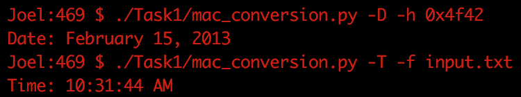
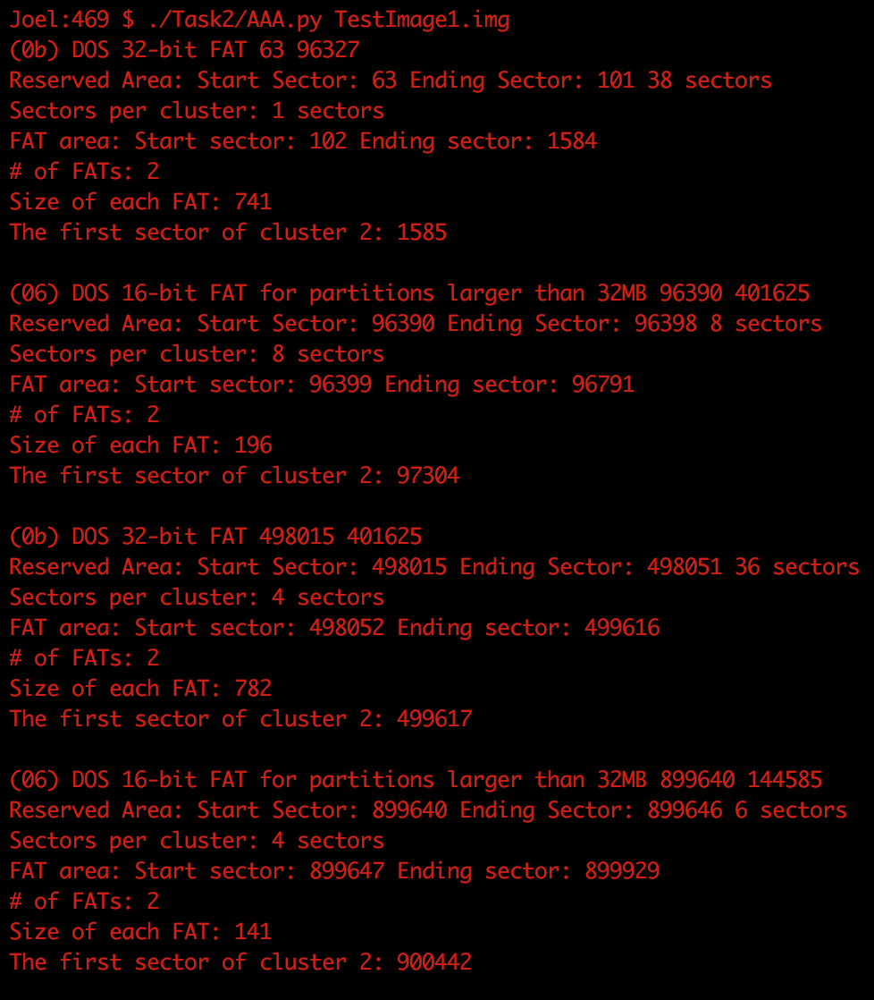
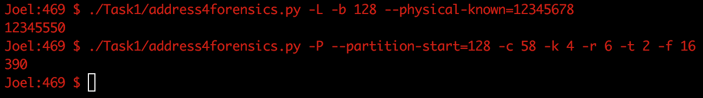

Contributions: 

* Joel Christiansen: mac_conversion, load and extract the partiton tables from the MBR, MakeFile, Readme, screenshots
* Katherine Kincade: address4forensics, MD5 and SHA-1 hashing, and extract information from VBR

Configuration:

* First, call `make`. This takes care of file permissions.  
* To use the mac conversion tool, call `./Task1/mac_conversion.py [args]`  
* To use the Aquisition, Authentication, and Analysis tool, call `./Task2/AAA.py [filename]`  
* To use the address4forensics tool, call `./Task1/address4forensics.py [args]`

Screenshots:

